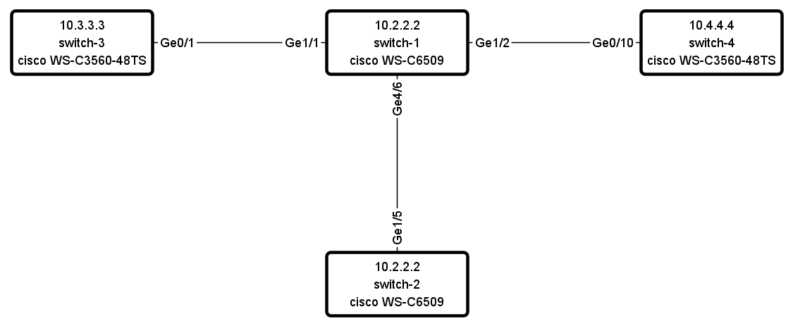

Formatters
==========

TTP supports a number of output formatters.

.. list-table::
   :widths: 20 80
   :header-rows: 1

   * - Name
     - Description
   * - `raw`_
     - default formatter, results returned as is
   * - `yaml`_
     - results transformed in a YAML structured, multi-line text
   * - `json`_
     - results transformed in a JSON structured, multi-line text
   * - `pprint`_
     - results transformed in a string using python pprint module
   * - `table`_
     - results transformed in a list of lists, each list representing table row
   * - `csv`_
     - uses table formatter results to emit CSV spreadsheet
   * - `tabulate`_
     - uses table formatter results to emit text table using `tabulate module <https://pypi.org/project/tabulate/>`_
   * - `excel`_
     - uses table formatter results to emit Excel table using `openpyxl module <https://openpyxl.readthedocs.io/en/stable/#>`_
   * - `jinja2`_
     - renders `Jinja2 template <https://palletsprojects.com/p/jinja/>`_ with parsing results
   * - `N2G`_
     - produces xml structured diagram using `N2G module <https://pypi.org/project/N2G/>`_

Formatters can accept various attributes to supply additional information or modify behavior.

In general case formatters take python structured data - dictionary, list, list of dictionaries etc. - as an input, format that data in certain way and return new representation of results.

raw
******************************************************************************

If format is raw, no formatting will be applied and native python structure will be returned, results will not be converted to string.

yaml
******************************************************************************

**Prerequisites**: Python PyYAML library need to be installed

This formatter will run results through PyYAML module to produce YAML structured results.

JSON
******************************************************************************

This formatter will run results through Python built-in JSON module ``dumps`` method to produce `JSON (JavaScript Object Notation) <http://json.org>` structured results.

.. note:: json.dumps() will have these additional attributes set ``sort_keys=True, indent=4, separators=(',', ': ')``

pprint
******************************************************************************

As the name implies, python built-in pprint module will be used to structure python data in a more readable.

table
******************************************************************************

This formatter will transform results into a list of lists, where first list item will represent table headers, all the rest of items will represent table rows.

For table formatter to work correctly, results data should have certain structure, namely:

* list of flat dictionaries
* single flat dictionary
* dictionary of flat dictionaries if ``key`` attribute provided

Flat dictionary - such a dictionary where all values are strings. It is not a limitation and in fact dictionary values can be of any structure, but they will be placed in table as is.

**Supported formatter arguments**

* ``path`` dot separated string to results that table formatter should use
* ``headers`` comma separated string of tab table headers, headers put randomly otherwise
* ``missing`` value to use to substitute empty cells in table, default is empty string - ""
* ``key`` key name to transform dictionary data to list of dictionaries
* ``strict`` (release 0.7.1) to indicate traverse function behavior while getting table data from results

.. note:: csv, excel and tabulate formatter use table formatter to construct a table structure. As a result all attributes supported by table formatter, inherently supported by csv, excel and tabulate formatters.

**Example-1**

Template::

    <input load="text">
    interface Loopback0
     ip address 192.168.0.113/24
    !
    interface Vlan778
     ip address 2002::fd37/124
    !
    </input>

    <input load="text">
    interface Loopback10
     ip address 192.168.0.10/24
    !
    interface Vlan710
     ip address 2002::fd10/124
    !
    </input>

    <group>
    interface {{ interface }}
     ip address {{ ip }}/{{ mask }}
    </group>

    <output format="table"/>

Results::

    [[['interface', 'ip', 'mask'],
      ['Loopback0', '192.168.0.113', '24'],
      ['Vlan778', '2002::fd37', '124'],
      ['Loopback10', '192.168.0.10', '24'],
      ['Vlan710', '2002::fd10', '124']]]

**Example-2**

This example is to demonstrate usage of ``key`` and other attributes

Template::

    <input load="text">
    interface Loopback0
     description Router-id-loopback
     ip address 192.168.0.113/24
    !
    interface Loopback1
     description Router-id-loopback
     ip address 192.168.0.1/24
    !
    interface Vlan778
     ip address 2002::fd37/124
     ip vrf CPE1
    !
    interface Vlan779
     ip address 2002::bbcd/124
     ip vrf CPE2
    !
    </input>
    <group name="interfaces**.{{ interface }}">
    interface {{ interface }}
     ip address {{ ip }}/{{ mask }}
     description {{ description }}
     ip vrf {{ vrf }}
    </group>

    <output
    path="interfaces"
    format="table"
    headers="intf, ip, mask, vrf, description, switchport"
    key="intf"
    missing="Undefined"
    />

Results::

    [[['intf', 'ip', 'mask', 'vrf', 'description', 'switchport'],
      ['Loopback0', '192.168.0.113', '24', 'Undefined', 'Router-id-loopback', 'Undefined'],
      ['Loopback1', '192.168.0.1', '24', 'Undefined', 'Router-id-loopback', 'Undefined'],
      ['Vlan778', '2002::fd37', '124', 'CPE1', 'Undefined', 'Undefined'],
      ['Vlan779', '2002::bbcd', '124', 'CPE2', 'Undefined', 'Undefined']]]

Above template produces this structure::

    [[{'interfaces': {'Loopback0': {'description': 'Router-id-loopback',
                                    'ip': '192.168.0.113',
                                    'mask': '24'},
                      'Loopback1': {'description': 'Router-id-loopback',
                                    'ip': '192.168.0.1',
                                    'mask': '24'},
                      'Vlan778': {'ip': '2002::fd37', 'mask': '124', 'vrf': 'CPE1'},
                      'Vlan779': {'ip': '2002::bbcd', 'mask': '124', 'vrf': 'CPE2'}}}]]

``key`` attribute instructs TTP to use *intf* as a name for *interfaces* dictionary keys while transforming it to a list of dictionaries.

csv
******************************************************************************

This formatter takes parsing result as an input, transforms it in list of lists using table formatter and emits csv structured table.

**Supported formatter arguments**

* ``sep`` separator character to use for csv formatter, default value is comma ``,``
* ``quote`` quote character to use for csv formatter, default value is double quote ``"``
* ``path`` dot separated string to results that csv formatter should use
* ``headers`` comma separated string of tab table headers, headers put randomly otherwise
* ``missing`` value to use to substitute empty cells in table, default is empty string - ``""``
* ``key`` key name to transform dictionary data to list of dictionaries

**Example**

Template::

    <input load="text">
    interface Loopback0
     ip address 192.168.0.113/24
    !
    interface Vlan778
     ip address 2002::fd37/124
    !
    </input>

    <group>
    interface {{ interface }}
     ip address {{ ip }}/{{ mask }}
    </group>

    <output format="csv" returner="terminal"/>

Results::

    interface,ip,mask
    Loopback0,192.168.0.113,24
    Vlan778,2002::fd37,124

tabulate
******************************************************************************

**Prerequisites:** `tabulate module <https://pypi.org/project/tabulate/>`_ need to be installed on the system.

Tabulate formatter uses python tabulate module to transform and emit results in a plain-text table.

**Supported formatter arguments**

* ``path`` dot separated string to results that tabulate formatter should use
* ``headers`` comma separated string of tab table headers, headers put randomly otherwise
* ``missing`` value to use to substitute empty cells in table, default is empty string - ""
* ``key`` key name to transform dictionary data to list of dictionaries
* ``format_attributes`` `**args, **kwargs` to pass on to tabulate object

**Example**

Template::

    <input load="text">
    router bgp 65100
      neighbor 10.145.1.9
        description vic-mel-core1
      !
      neighbor 192.168.101.1
        description qld-bri-core1
    </input>

    <group name="bgp_config">
    router bgp {{ bgp_as }}
      <group name="peers">
      neighbor {{ peer }}
        description {{ description  }}
      </group>
    </group>

    <output
    name="out2"
    path="bgp_config.peers"
    format="tabulate"
    returner="terminal"
    format_attributes="tablefmt='fancy_grid'"
    />

Results printed to terminal screen::

    ╒═══════════════╤═══════════════╕
    │ description   │ peer          │
    ╞═══════════════╪═══════════════╡
    │ vic-mel-core1 │ 10.145.1.9    │
    ├───────────────┼───────────────┤
    │ qld-bri-core1 │ 192.168.101.1 │
    ╘═══════════════╧═══════════════╛

jinja2
******************************************************************************

**Prerequisites:** `Jinja2 module <https://palletsprojects.com/p/jinja/>`_  need to be installed on the system

This formatter allow to render parsing results with jinja2 template. Jinja2 template should be enclosed in output tag text data. Jinja2 templates can help to produce any text output out of parsing results.

Within jinja2, the whole parsing results passed in `_data_` variable, that variable can be referenced in template accordingly.

**Example**

Template::

    <input load="text">
    interface Loopback0
     ip address 192.168.0.113/24
    !
    interface Vlan778
     ip address 2002::fd37/124
    !
    </input>

    <input load="text">
    interface Loopback10
     ip address 192.168.0.10/24
    !
    interface Vlan710
     ip address 2002::fd10/124
    !
    </input>

    <group>
    interface {{ interface }}
     ip address {{ ip }}/{{ mask }}
    </group>

    <output format="jinja2" returner="terminal">
    
    
    if_cfg id {{ item['interface'] }}
        ip address {{ item['ip'] }}
        subnet mask {{ item['mask'] }}
    #
    
    
    </output>

Results::

    if_cfg id Loopback0
        ip address 192.168.0.113
        subnet mask 24
    #
    if_cfg id Vlan778
        ip address 2002::fd37
        subnet mask 124
    #
    if_cfg id Loopback10
        ip address 192.168.0.10
        subnet mask 24
    #
    if_cfg id Vlan710
        ip address 2002::fd10
        subnet mask 124
    #

excel
******************************************************************************

**Prerequisites:** `openpyxl module <https://openpyxl.readthedocs.io/en/stable/#>`_ need to be installed on the system

This formatter takes table structure defined in output tag text and transforms parsing results into table on a per tab basis using `table`_ formatter, as a results all attributes supported by table formatter can be used in excel formatter as well.

**Supported formatter arguments**

* ``table`` list of dictionaries describing excel tabs and tables structure
* ``update`` (release 0.7.0) boolean, if set to True will update `.xlsx` document if it exists, default is False

Each dictionary item in ``table`` structure can have these attributes:

* ``path`` dot separated string to results that excel formatter should use
* ``tab_name`` name of this tab in excel spreadsheet, by default tab names are "Sheet<number>"
* ``headers`` comma separated string of tab table headers, headers put randomly otherwise
* ``missing`` value to use to substitute empty cells in table, default is empty string - ""
* ``key`` key name to transform dictionary data to list of dictionaries
* ``strict`` (release 0.7.1) to indicate traverse function behavior while getting table data from results

**Notes on update**

By default ``excel`` formatter will replace existing `.xlsx` file, if ``update`` parameter set to ``True`` and output xlsx file exists, spreadsheet updated following this logic:

* existing tabs appended with new data or left intact
* new tabs created if they does not exists and filled with data

**Example**

Template::

    <input load="text">
    interface Loopback0
     description Router-id-loopback
     ip address 192.168.0.113/24
    !
    interface Loopback1
     description Router-id-loopback
     ip address 192.168.0.1/24
    !
    interface Vlan778
     ip address 2002::fd37/124
     ip vrf CPE1
    !
    interface Vlan779
     ip address 2002::bbcd/124
     ip vrf CPE2
    !
    </input>

    <group name="loopbacks**.{{ interface }}">
    interface {{ interface | contains("Loop") }}
     ip address {{ ip }}/{{ mask }}
     description {{ description }}
     ip vrf {{ vrf }}
    </group>

    <group name="vlans*">
    interface {{ interface | contains("Vlan") }}
     ip address {{ ip }}/{{ mask }}
     description {{ description }}
     ip vrf {{ vrf }}
    </group>

    <output
    format="excel"
    returner="file"
    filename="excel_out_%Y-%m-%d_%H-%M-%S.xslx"
    url="./Output/"
    load="yaml"
    >
    table:
      - headers: interface, ip, mask, vrf, description
        path: loopbacks
        key: interface
        tab_name: loopbacks
      - path: vlans
    </output>

TTP will produce excel table with two tabs using results from different groups. Table will be saved under *./Output/* path in *excel_out_%Y-%m-%d_%H-%M-%S.xslx* file.

N2G
******************************************************************************

**Prerequisites:** `N2G module <https://pypi.org/project/N2G/>`_ need to be installed on the system

N2G takes structured data and transforms it into xml format supported by a number of diagram editors.

**Supported formatter arguments**

* ``path`` dot separated string to results that N2G formatter should use to produce XML diagram.
* ``module`` name of N2G diagramming module to use - ``yed`` or ``drawio``
* ``node_dups`` what to do with node duplicates - ``skip`` (default), ``log``, ``update``
* ``link_dups`` what to do with link duplicates - ``skip`` (default), ``log``, ``update``
* ``method`` name of N2G method to load data - ``from_list`` (default), ``from_dict``, ``from_csv``
* ``method_kwargs`` keyword arguments dictionary to pass to ``method``
* ``algo`` name of layout algorithm to use for diagram

**Example**

In this example data from ``show cdp neighbors detail`` command output parsed in a list of dictionaries and fed into N2G to produce diagram in yED graphml format.

Template::

    <input load="text">
    switch-1#show cdp neighbors detail
    -------------------------
    Device ID: switch-2
    Entry address(es):
      IP address: 10.2.2.2
    Platform: cisco WS-C6509,  Capabilities: Router Switch IGMP
    Interface: GigabitEthernet4/6,  Port ID (outgoing port): GigabitEthernet1/5

    -------------------------
    Device ID: switch-3
    Entry address(es):
      IP address: 10.3.3.3
    Platform: cisco WS-C3560-48TS,  Capabilities: Switch IGMP
    Interface: GigabitEthernet1/1,  Port ID (outgoing port): GigabitEthernet0/1

    -------------------------
    Device ID: switch-4
    Entry address(es):
      IP address: 10.4.4.4
    Platform: cisco WS-C3560-48TS,  Capabilities: Switch IGMP
    Interface: GigabitEthernet1/2,  Port ID (outgoing port): GigabitEthernet0/10
    </input>

    <input load="text">
    switch-2#show cdp neighbors detail
    -------------------------
    Device ID: switch-1
    Entry address(es):
      IP address: 10.1.1.1
    Platform: cisco WS-C6509,  Capabilities: Router Switch IGMP
    Interface: GigabitEthernet1/5,  Port ID (outgoing port): GigabitEthernet4/6
    </input>

    <vars>
    hostname='gethostname'
    IfsNormalize = {
        'Ge':['^GigabitEthernet']
    }
    </vars>

    <group name="cdp*" expand="">
    Device ID: {{ target.id }}
      IP address: {{ target.top_label }}
    Platform: {{ target.bottom_label | ORPHRASE }},  Capabilities: {{ ignore(ORPHRASE) }}
    Interface: {{ src_label | resuball(IfsNormalize) }},  Port ID (outgoing port): {{ trgt_label | ORPHRASE | resuball(IfsNormalize) }}
    {{ source | set("hostname") }}
    </group>

    <output format="n2g" load="python">
    path = "cdp"
    module = "yed"
    node_duplicates = "update"
    method = "from_list"
    algo = "kk"
    </output>

    <out returner="file" url="./Output/" filename="cdp_diagram.graphml"/>

Results will be saved in `./Output/cdp_diagram.graphml` file and after editing diagram might look like this:

