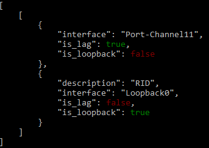

Returners
=========

TTP has `file`_, `terminal`_ and `self`_ returners. The purpose of returner is to return or emit or save data to certain destination.

.. list-table::
   :widths: 10 90
   :header-rows: 1

   * - Returner
     - Description
   * - `self`_
     - return result to calling function
   * - `file`_
     - save results to file
   * - `terminal`_
     - print results to terminal screen
   * - `syslog`_
     - send results over UDP to Syslog server

self
-------------------------------------

Default returner, data processed by output returned back to ttp for further processing, that way outputs can be chained to produce required results. Another use case is when ttp used as a module, results can be formatted retrieved out of ttp object.

file
-------------------------------------

Results will be saved to text file on local file system. One file will be produced per template to contain all the results for all the inputs and groups of this template.

**Supported returner attributes**

* ``url`` OS path to folder where file should be stored
* ``filename`` name of the file, can contain these time formatter::

   * ``%m``  Month as a decimal number [01,12].
   * ``%d``  Day of the month as a decimal number [01,31].
   * ``%H``  Hour (24-hour clock) as a decimal number [00,23].
   * ``%M``  Minute as a decimal number [00,59].
   * ``%S``  Second as a decimal number [00,61].
   * ``%z``  Time zone offset from UTC.
   * ``%a``  Locale's abbreviated weekday name.
   * ``%A``  Locale's full weekday name.
   * ``%b``  Locale's abbreviated month name.
   * ``%B``  Locale's full month name.
   * ``%c``  Locale's appropriate date and time representation.
   * ``%I``  Hour (12-hour clock) as a decimal number [01,12].
   * ``%p``  Locale's equivalent of either AM or PM.

For instance, ``filename="OUT_%Y-%m-%d_%H-%M-%S_results.txt"`` will render to ``"OUT_2019-09-09_18-19-58_results.txt"`` filename. By default filename is set to ``"output_<ctime>.txt"``, where ``"ctime"`` is a string produced after rendering ``"%Y-%m-%d_%H-%M-%S"`` by python `time.strftime() <https://docs.python.org/3/library/time.html#time.strftime>`_ function.

In addition to formatting filename using time formatter, using ``_ttp_["vars"]`` and ``_ttp_["global_vars"]`` dictionaries also supported, but due to the way how these dictionaries populated, attention should be paid to correctness of filenames - test before use. In particular, ``_ttp_["global_vars"]`` contains variables across all templates, variables in that dictionary can be overridden as parsing progresses. On the other hand ``_ttp_["vars"]`` dictionary always contains variables from ``<vars>`` tag and values local to specific input item being processed, by the time outputters start processing data, ``_ttp_["vars"]`` dictionary contains values produced by last input item.

**Example-1**

Format filename using device hostname on a per-input basis.

Template::

    <input load="text">
    switch-sw1# show run interfaces
    interface Port-Chanel2
      vlan 100
    interface Loopback10
      vlan 200
    </input>

    <input load="text">
    switch-sw2# show run interfaces
    interface Port-Chanel11
      vlan 10
    interface Loopback0
      vlan 20
    </input>

    <vars>
    host_name = "gethostname"
    </vars>

    <group name="interfaces" output="save_to_file">
    interface {{ interface }}
      vlan {{ vlan | to_int }}
    </group>

    <output name="save_to_file">
    returner="file"
    url="./Output/"
    filename="{host_name}_interfaces.txt"
    </output>

Above template uses group specific outputter to save group results in a file, filenames will contain device hostname. These two files produced::

    ./Output/switch-sw1_interfaces.txt
    ./Output/switch-sw2_interfaces.txt

terminal
-------------------------------------

Results will be printed to terminal window. Terminal returner support colouring output using `colorama module <https://pypi.org/project/colorama/>`_

**Supported returner attributes**

* ``colour`` if present with any value, colorama module will be initiated to colour certain words in output
* ``red_words`` comma separated list of patterns to colour in red, default is *False,No,Failed,Error,Failure,Fail,false,no,failed,error,failure,fail*
* ``green_words`` comma separated list of patterns to colour in green, default is *True,Yes,Success,Ok,true,yes,success,ok*
* ``yeallow_words`` comma separated list of patterns to colour in yellow, default is *Warning,warning*

**Example**

Template::

    <input load="text">
    interface Port-Channel11
      description Storage Management
    interface Loopback0
      description RID
    interface Vlan777
      description Management
    </input>

    <group>
    interface {{ interface | contains("Port-Channel") }}
      description {{ description }}
      {{ is_lag | set(True) }}
      {{ is_loopback| set(False) }}
    </group>

    <group>
    interface {{ interface | contains("Loop") }}
      description {{ description }}
      {{ is_lag | set(False) }}
      {{ is_loopback| set(True) }}
    </group>

    <output
    returner="terminal"
    colour=""
    red="false,False"
    green="true,True"
    format="json"
    />

Results printed to screen:

syslog
-----------

This returner send result to remote Syslog servers over UDP using `syslog handler <https://docs.python.org/3/library/logging.handlers.html#sysloghandler>`_ from Python built-in loggin library.

**Supported returner attributes**

* ``servers`` list of servers to send logs to
* ``port`` UDP port servers listening on, default 514
* ``facility`` syslog facility number, default 77
* ``path`` path to parsing results emit to syslog
* ``iterate`` if set to True and parsing result is a list, iterates and send each item individually, default is *True*
* ``interval`` milliseconds to wait between sending messages to syslog server, default 1 ms

Sample Template::

    <input load="text">
    router-2-lab#show ip arp
    Protocol  Address          Age (min)  Hardware Addr   Type   Interface
    Internet  10.1.13.4               -   0050.5685.14d6  ARPA   GigabitEthernet3.13
    Internet  10.1.13.5               -   0050.5685.14d7  ARPA   GigabitEthernet4.14
    </input>

    <input load="text">
    router-3-lab#show ip arp
    Protocol  Address          Age (min)  Hardware Addr   Type   Interface
    Internet  10.1.13.1              98   0050.5685.5cd1  ARPA   GigabitEthernet1.11
    Internet  10.1.13.3               -   0050.5685.14d5  ARPA   GigabitEthernet2.12
    </input>

    <vars>hostname="gethostname"</vars>

    <group name="arp_table*" method="table">
    Internet  {{ ip }}  {{ age | DIGIT }}   {{ mac }}  ARPA   {{ interface }}
    Internet  {{ ip }}  -                   {{ mac }}  ARPA   {{ interface }}
    {{ hostname | set(hostname) }}
    </group>

    <output returner="syslog" load="python">
    servers="192.168.1.175"
    port="10514"
    path="arp_table"
    iterate=True
    facility=77
    </output>

